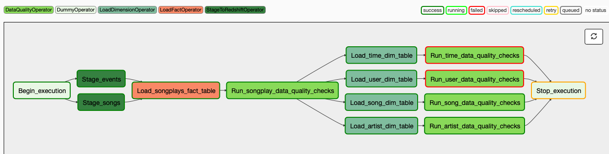

# Project Data Pipeline

## Background

The background to this project is a fictitious music streaming company that has decided that it is time to introduce more automation and monitoring to their data warehouse ETL pipelines and want to achieve this using Apache Airflow.

### Project Goals
The project goals were to build a high grade data pipeline that is dynamic and built from re-usable tasks that can be monitored and allow for easy backfilling of data. There was also a requirement to include data quality checks as part of the pipeline to catch any discrepancies in the datasets.

### Platforms
The JSON source data was available in S3 and the data ETL steps were carried out in Amazon Redshift, orchestrated by Apache Airflow.

The following staging tables are created in Amazon Redshift:
- staging_events
- staging_songs

The following data warehouse tables are created in Amazon Redshift:
- songplays  _(fact table)_
- songs
- artists
- time
- users

### Required Workflow

This project implements in Apache Airflow the workflow shown in the DAG below:

 

 ## Implementation

 ### Folder Structure

 - _dags_ Contains the python code specififying the DAG to implement the required workflow.  The tasks of the DAG are specified by passing arguments to the bespoke Operators that were implemented for the project.
 - _plugins/helpers_ Contains a class which defines the SQL commands used as the basis for populating the fact and dimension tables of the Data Warehouse.

 - _plugins/operators_ Contains the operators written to enable creation of the tasks shown in the DAG and required to complete the ETL pipeline as specified.

 ### Operators
 Several Operators (parameterised to enable re-use) were implemented:

 - _stage_redshift.py_ : Copy data from S3 to staging in Redshift
 - _load_fact.py_ : Load a fact table on Redshift
 - _load_dimension.py_ : Load a dimension table on Redshift
 - _data_quality.py_ : Execute quality checks on Redshift database tables.  Quality checks enable any choice of SQL to be passed to the Operator along with an assertion test to validate the result.
